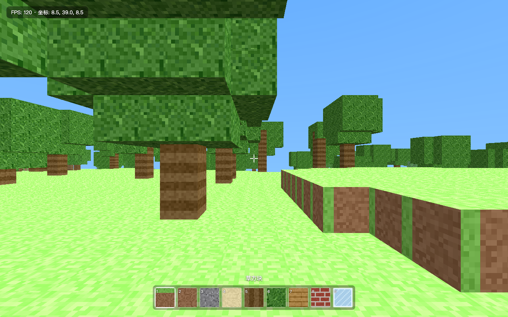

# dsh-preview

English | [中文](README.zh.md)

**Eyes for your DeepSeek Harness agent — it opens, sees, and fixes what it builds.**

Your dsh agent can write a whole web app, but it has never seen one. It ships CSS it cannot look at, "verifies" pages by re-reading source code, and asks *you* to open the browser and describe what went wrong. `dsh-preview` closes that loop: six headless-browser tools plus a bundled verification skill, so the agent opens the page it just built, checks the console, reads the rendered DOM, exercises the UI, and hands you a screenshot — before it claims the work is done.

## What it looks like



*Screenshot taken by the agent itself, mid-verification.*

A real, unedited run: a dsh agent (DeepSeek-V4-Pro) was asked to verify a Three.js voxel game it had built earlier. With `dsh-preview` installed it did all of this autonomously:

1. `browser_open http://localhost:8091` — page loaded, no console errors during load.
2. `browser_console` — one 404 (`/favicon.ico`), correctly triaged as harmless; all 7 local resources returned 200.
3. `browser_read` — confirmed the start screen copy, control help, and HUD text.
4. `browser_interact` (click the start button) — overlay closed, HUD appeared, **it watched the coordinates fall from 41.0 to 39.0 and FPS settle at 120**, and concluded the physics and render loops were alive. No new errors.
5. `browser_screenshot` — before/after PNGs saved into the workspace for the human.
6. Reported exactly what it verified — and what it *couldn't* (GPU rendering fidelity, real pointer-lock feel).

No human relayed a single screenshot.

## Install

```sh
dsh plugin --profile web add dsh-preview
```

Works with any Chromium on your machine — Google Chrome and Microsoft Edge are picked up automatically; otherwise run `npx playwright install chromium` once and set `browserChannels` to `[chromium]`.

Requires Node `^22.19 || >=24` (same as dsh itself).

## Tools

| Tool | What it does |
| --- | --- |
| `browser_open` | Open an http(s) URL or a **local file/directory** (served automatically over 127.0.0.1). Returns a `pageId` and any console errors raised during load. |
| `browser_console` | Console messages + failed network requests captured since load. |
| `browser_read` | Deterministic no-vision reading: rendered `text`, outer `html`, or `styles` (bounding box + key computed styles of a selector). |
| `browser_interact` | Click / type / press / scroll-to on a selector; reports console errors the interaction caused. |
| `browser_screenshot` | Viewport, full-page, or single-element PNG saved into the workspace. |
| `browser_close` | Close a page when verification is done. |

`browser_read` is the heart of the design: a text-only model verifies layout facts (box sizes, colors, display values, rendered copy) *deterministically*, instead of hallucinating over pixels. Screenshots are for the human in the loop.

## The bundled skill

The plugin ships a `frontend-verify` skill that teaches the agent the discipline: **open → console → read → interact → screenshot → fix → re-verify**, report what passed verbatim, and name what could not be verified instead of implying full coverage. Disable it with `registerSkill: false` if you run your own playbook.

## Configuration

All tunables are plugin config — set them in your profile's `cordis.patch.yml`:

```yaml
- id: preview
  name: dsh-preview
  config:
    headless: true
    browserChannels: [chrome, msedge, chromium]
    viewportWidth: 1280
    viewportHeight: 800
    navigationTimeoutMs: 15000
    actionTimeoutMs: 5000
    screenshotDir: .dsh-preview
    maxReadChars: 20000
    maxConsoleMessages: 100
    allowedHosts: []          # extra hostnames browser_open may visit
    registerSkill: true
```

## Security model

- `localhost` / `127.0.0.1` / `::1` are always allowed — that is what frontend verification needs.
- Any other host is **refused by default**. Grant specific hosts via `allowedHosts`; the error message tells the model to ask you rather than work around it.
- Local paths are served read-only from their own directory on an ephemeral 127.0.0.1 port, with path containment.
- The plugin never types credentials and the skill forbids screenshotting pages with secrets.

## Known limitations

- Headless rendering differs from a real desktop browser: pointer lock, some GPU codepaths, and OS dialogs may behave differently. The bundled skill instructs the agent to say so when it matters.
- No vision description yet: screenshots are for humans; machine verification goes through `browser_read`/`browser_console`. Automatic screenshot→text description through your existing dsh model routes is on the roadmap.
- One shared browser process per dsh process; pages are cheap, but parallel agents share it.

## Development

```sh
git clone https://github.com/Viger1/dsh-preview.git && cd dsh-preview
corepack pnpm install
corepack pnpm run build
dsh plugin --profile web add /absolute/path/to/dsh-preview   # link the local checkout
```

`corepack pnpm run watch` + a config touch gives a fast edit-reload loop.

## Family

| Plugin | What it gives your agent |
| --- | --- |
| **dsh-preview** (this repo) | 👁 Eyes — verify what it builds: open, read, screenshot, self-check |
| [dsh-pilot](https://github.com/Viger1/dsh-pilot) | ✋ Hands — operate any page by accessibility refs, with a network-layer origin fence |
| [dsh-review](https://github.com/Viger1/dsh-review) | 🔍 Judgement — find defects, then try to refute each one before reporting it |
| [dsh-design](https://github.com/Viger1/dsh-design) | 🎨 Taste — constrain the choices, then measure whether the result kept them |

Each installs independently and they coexist (distinct tool prefixes, shared engineering discipline).

## License

[MIT](LICENSE)
